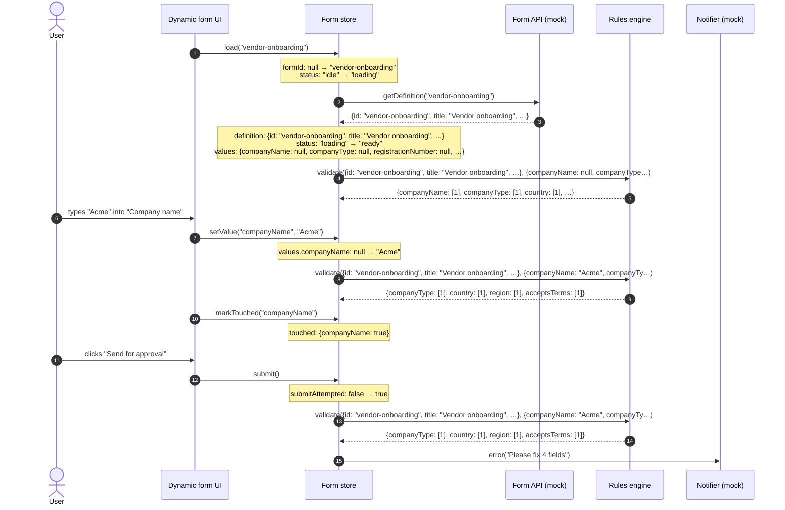

# Dynamic form blocks submission while required fields are missing

Generated from `src/app/features/dynamic-form/dynamic-form.integration.spec.ts` by `npm run test:trace`.

```mermaid
sequenceDiagram
  autonumber
  actor U as User
  participant P0 as Dynamic form UI
  participant P1 as Form store
  participant P2 as Form API (mock)
  participant P3 as Rules engine
  participant P4 as Notifier (mock)
  P0->>P1: load("vendor-onboarding")
  Note over P1: formId: null → "vendor-onboarding"<br/>status: "idle" → "loading"
  P1->>P2: getDefinition("vendor-onboarding")
  P2-->>P1: {id: "vendor-onboarding", title: "Vendor onboarding", …}
  Note over P1: definition: {id: "vendor-onboarding", title: "Vendor onboarding", …}<br/>status: "loading" → "ready"<br/>values: {companyName: null, companyType: null, registrationNumber: null, …}
  P1->>P3: validate({id: "vendor-onboarding", title: "Vendor onboarding", …}, {companyName: null, companyType…)
  P3-->>P1: {companyName: [1], companyType: [1], country: [1], …}
  U->>P0: types "Acme" into "Company name"
  P0->>P1: setValue("companyName", "Acme")
  Note over P1: values.companyName: null → "Acme"
  P1->>P3: validate({id: "vendor-onboarding", title: "Vendor onboarding", …}, {companyName: "Acme", companyTy…)
  P3-->>P1: {companyType: [1], country: [1], region: [1], acceptsTerms: [1]}
  P0->>P1: markTouched("companyName")
  Note over P1: touched: {companyName: true}
  U->>P0: clicks "Send for approval"
  P0->>P1: submit()
  Note over P1: submitAttempted: false → true
  P1->>P3: validate({id: "vendor-onboarding", title: "Vendor onboarding", …}, {companyName: "Acme", companyTy…)
  P3-->>P1: {companyType: [1], country: [1], region: [1], acceptsTerms: [1]}
  P1->>P4: error("Please fix 4 fields")
```
