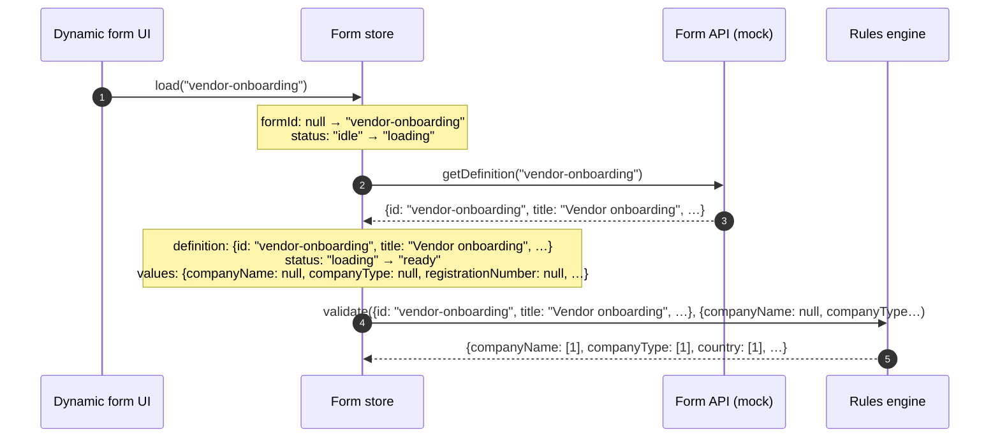

# Dynamic form loads the form definition from the backend and renders its sections

Generated from `src/app/features/dynamic-form/dynamic-form.integration.spec.ts` by `npm run test:trace`.

```mermaid
sequenceDiagram
  autonumber
  participant P0 as Dynamic form UI
  participant P1 as Form store
  participant P2 as Form API (mock)
  participant P3 as Rules engine
  P0->>P1: load("vendor-onboarding")
  Note over P1: formId: null → "vendor-onboarding"<br/>status: "idle" → "loading"
  P1->>P2: getDefinition("vendor-onboarding")
  P2-->>P1: {id: "vendor-onboarding", title: "Vendor onboarding", …}
  Note over P1: definition: {id: "vendor-onboarding", title: "Vendor onboarding", …}<br/>status: "loading" → "ready"<br/>values: {companyName: null, companyType: null, registrationNumber: null, …}
  P1->>P3: validate({id: "vendor-onboarding", title: "Vendor onboarding", …}, {companyName: null, companyType…)
  P3-->>P1: {companyName: [1], companyType: [1], country: [1], …}
```
