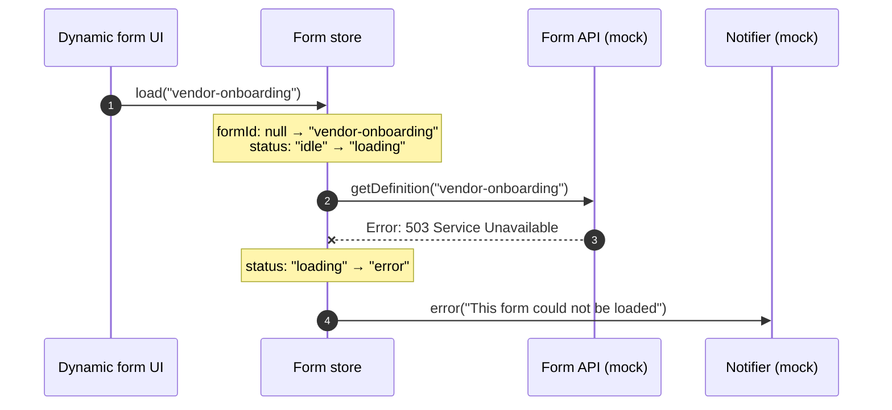

# Dynamic form tells the user when the form cannot be loaded

Generated from `src/app/features/dynamic-form/dynamic-form.integration.spec.ts` by `npm run test:trace`.

```mermaid
sequenceDiagram
  autonumber
  participant P0 as Dynamic form UI
  participant P1 as Form store
  participant P2 as Form API (mock)
  participant P3 as Notifier (mock)
  P0->>P1: load("vendor-onboarding")
  Note over P1: formId: null → "vendor-onboarding"<br/>status: "idle" → "loading"
  P1->>P2: getDefinition("vendor-onboarding")
  P2--xP1: Error: 503 Service Unavailable
  Note over P1: status: "loading" → "error"
  P1->>P3: error("This form could not be loaded")
```
